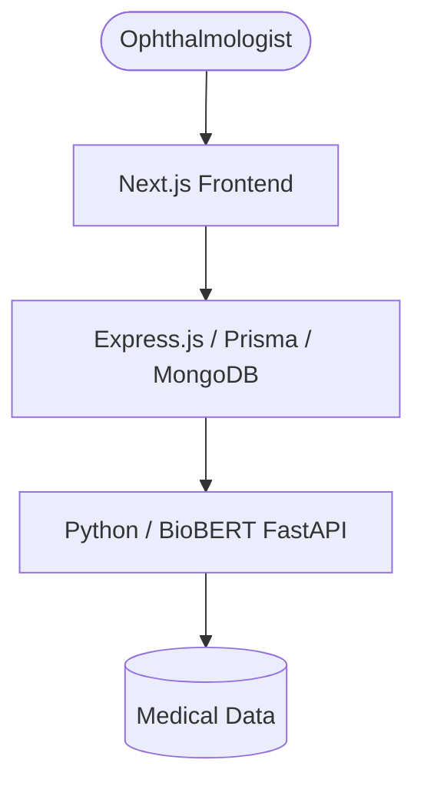

# ClinicaEye-NLP: Clinical Ophthalmic Assistant

A production-grade, medically accurate AI system for ophthalmology. This project harmonizes clinical data (17k structured Kaggle rows + 33k unstructured Eye-QA rows) to provide intent classification and named entity recognition for ophthalmic records.

## Project Architecture



## Directory Map

-   **[/web](./web)**: Next.js App Router high-fidelity UI (The 'Lamborghini' Experience).
-   **[/backend](./backend)**: Express.js, Prisma, and MongoDB API Gateway.
-   **[/ai](./ai)**: Python FastAPI service with BioBERT for inference.
-   **[/Data](./Data)**: Raw and processed medical datasets.

## Performance Targets
- **SLA**: < 2s for all AI inference requests.
- **Accuracy**: $F_1$-Score $\ge$ 85%.

## Getting Started

### Prerequisites
- Node.js (Latest LTS)
- Python 3.10+
- MongoDB

### Local Development
1. **AI Service**: `cd ai && venv\Scripts\activate && pip install -r requirements.txt`
2. **Backend**: `cd backend && npm install && npx prisma generate`
3. **Frontend**: `cd web && npm install && npm run dev`

### Docker Deployment
```bash
docker-compose up --build
```
